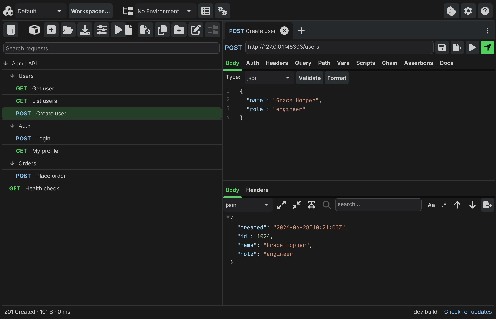
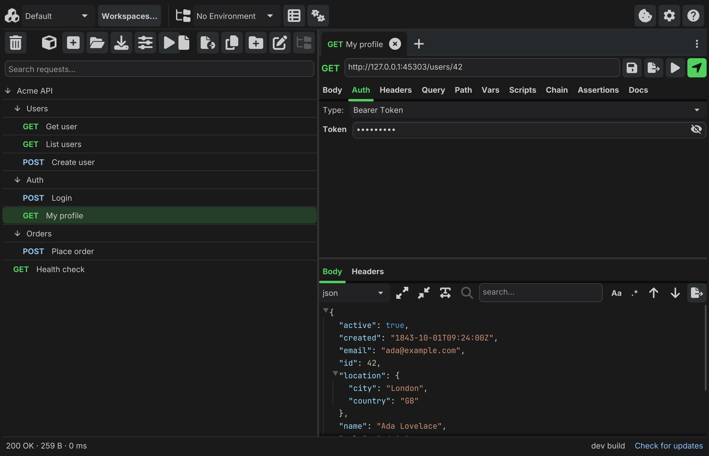
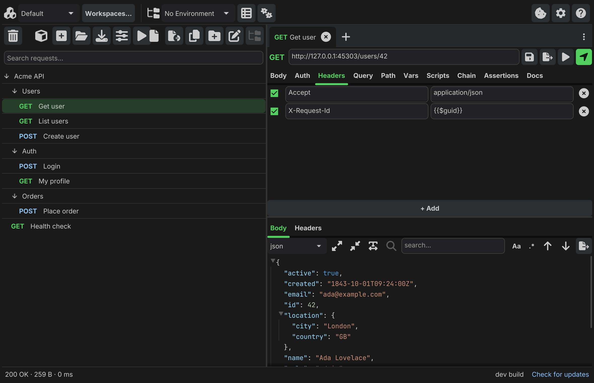
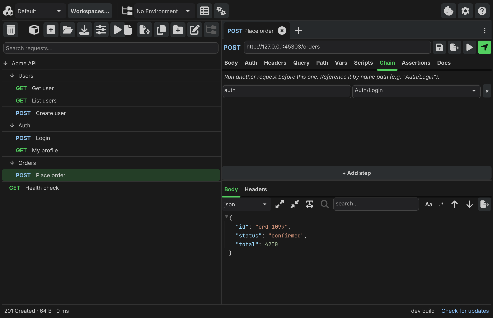

# Helena 🐱

A small, single-binary, cross-platform API client — a native alternative to
Postman and Bruno — built with **Go + [Fyne](https://fyne.io)**. One
self-contained ~35 MB binary, no Electron, no telemetry.

[](https://github.com/ideaconnect/helena/actions/workflows/ci.yml)

## Features

- **Workspaces, collections, folders, requests** stored as plain Open
  Collection YAML on disk — version-control them like any other source code.
  Credentials (auth secrets + Secret env vars) are kept out of that YAML —
  externalized to a store under your config dir — so a committed collection
  carries no cleartext secret (see [Privacy](#privacy)).
- **Environments per collection** with `{{variable}}` resolution everywhere
  (URL, query params, headers, body) plus a live preview of the resolved URL.
- **Authentication — nine schemes**, all with `{{variable}}` substitution and
  credentials kept out of the committed YAML: Basic, Bearer, API Key,
  OAuth 2.0 (client-credentials and authorization-code + PKCE, with token
  caching), OAuth 1.0a, WSSE, AWS Signature v4, HTTP Digest, and NTLM. See the
  [authentication guide](docs/guide/auth.md).
- **Scripting, tests & request chaining** — per-request pre/post JavaScript
  hooks (pure-Go goja) with a curated `helena.*` API, a `test()`/`expect()`
  framework and a no-code Assertions tab, plus before-hooks that run other
  requests first and feed their results into the next one. See
  [Request chaining](#request-chaining).
- **Real-time — SSE & WebSocket** — stream Server-Sent Events into the response
  view, or open a two-way WebSocket (`ws://` / `wss://`) session with a live
  transcript. Both are hand-rolled on the Go standard library.
- **Request builder** — method, URL, query params, headers, body
  (JSON / XML / text / GraphQL / form-urlencoded / multipart / file). Validate +
  Format buttons for JSON and XML.
- **Response viewer** — raw, pretty JSON, pretty XML, headers. Status line
  shows `200 OK · 1.2 KB · 87 ms`.
- **CORS advisory.** Helena always sends the request (it isn't a browser),
  but flags responses a browser would have blocked.
- **Import** OpenAPI 3, Swagger 2, WSDL, or Postman — from a local file or a
  URL — or paste a cURL command to build a request.
- **Export** any request to cURL, wget, JavaScript fetch, Python requests, or
  Go net/http, with Copy-to-clipboard.
- **Settings** — invalid-SSL toggle, CORS warning, follow-redirects, request
  timeout, max response size (MiB), light/dark/system theme. Persisted in your OS's standard config
  dir (`AppData\Roaming` on Windows, `~/Library/Application Support` on
  macOS, `~/.config` on Linux).
- **Keyboard shortcuts** (Mod = Ctrl on Linux/Windows, ⌘ on macOS):
  - **Mod+Enter** Send · **Mod+S** Save · **Mod+O** Open · **Mod+I** Import
  - **Mod+N** New request · **Mod+Shift+N** New collection · **Mod+D** Duplicate
  - **Mod+E** Environments · **Mod+,** Settings · **F1** show all shortcuts

## Download

Pre-built Linux (amd64), Windows (amd64 and arm64), and macOS (arm64) binaries
are attached to each
[GitHub Release](https://github.com/ideaconnect/helena/releases). macOS binaries are
built in CI but not yet signed/notarized for Gatekeeper — see
[docs/PACKAGING.md](docs/PACKAGING.md).

**Updates** are delivered via package managers (as they land) or by
re-downloading a release — Helena does not check for updates at runtime, to
keep its [no-background-traffic guarantee](#privacy). Run `helena --version`
to see your build. See [docs/PACKAGING.md](docs/PACKAGING.md) for the full
distribution status.

## Screenshots

<!-- Captures are generated headlessly from the real UI with `make screenshots`
     and live in website/assets/img/ (shared with the project website). -->



| Authentication | Headers & response | Request chaining |
| --- | --- | --- |
|  |  |  |

## Quickstart

To get a feel for Helena without writing a request from scratch, open the
bundled sample collection:

1. Launch Helena.
2. Click **Open…** in the Collections sidebar.
3. Select [examples/httpbin/](examples/httpbin/) inside this repo.

The sample has two requests hitting [httpbin.org](https://httpbin.org) — a
`GET /anything` with a query param and a `POST /anything` with a JSON body —
plus a `default` environment that provides `{{base_url}}`. Select either
request in the tree, press **Mod+Enter**, and you should see a structured
response.

## Request chaining

A request can declare **before-hooks** — other requests that Helena runs first,
in order, every time you Send it. Each hook gets an **alias**, and the
predecessor's result is then available to the dependent request. This is how you
feed a value produced by one request (a login token, the id of a record you just
created) into another.

**Declare the step.** On the dependent request, open the **Chain** tab and add a
row: an alias (say `login`) and the path to another request in the same
collection (say `Auth/Login`). On Send, `Auth/Login` executes first; then your
request runs with `chain.login` populated. Chaining is recursive (a hook's own
hooks run first) and cycle-checked; a request only ever sees its own aliases.

### Use a chained result as a `{{variable}}`

`{{chain.<alias>.…}}` resolves anywhere a normal `{{variable}}` does — URL, query
params, headers, **body, and auth fields**. To send a login token as the Bearer
credential, set the request's **Auth → Bearer Token** to:

    {{chain.login.response.json.token}}

The available paths:

| Template | Resolves to |
| --- | --- |
| `{{chain.<alias>.response.json.<path>}}` | a field of the parsed JSON body — dotted (`data.user.name`), array elements by index (`items.0.id`) |
| `{{chain.<alias>.response.headers.<Name>}}` | a response header (case-insensitive) |
| `{{chain.<alias>.response.status}}` / `.statusText` | status code / status line |
| `{{chain.<alias>.response.body}}` / `.text` | the raw response body |
| `{{chain.<alias>.request.url}}` / `.method` / `.body` | what the predecessor was sent |

Only **scalar** leaves resolve (string / number / bool; `null` → empty). They
resolve at Send time, *after* the chain runs — so the URL-bar preview leaves them
untouched, and an unresolvable chain path (wrong alias or missing field) fails
the Send with an `unresolved variables` error. XML response bodies aren't
navigable from templates — use a script for those.

### Use a chained result in a script

For anything beyond substitution (conditionals, reshaping, combining values),
read `chain.<alias>` in the dependent request's **Scripts → Pre-request** hook —
the same shape as the template paths, plus lazily parsed `json` / `xml`:

```js
// Mutate this request directly:
request.headers["Authorization"] = "Bearer " + chain.login.response.json.token;

// …or stash a value as a session variable, then use {{token}} anywhere:
helena.env.set("token", chain.login.response.json.token);
```

`helena.env.set` writes an in-memory **session overlay** (never saved to your env
file) that layers over the active environment for the rest of the process. You
can also push from the other end: give the chained request a **Post-response**
hook that runs `helena.env.set("token", response.json.token)`, and the dependent
request just uses `{{token}}`.

The full scripting surface — the `helena.*` API and the `request` / `response`
object shapes — is documented in
[internal/scripting/README.md](internal/scripting/README.md).

## Build from source

Building Helena yourself is free on every platform. This is the short version;
the full copy-paste guide (per-distro dependencies, release-grade build flags,
cross-arch notes, troubleshooting) is in [docs/BUILDING.md](docs/BUILDING.md).

Requirements:

- Go 1.26+ to build. The exact build toolchain is pinned in `go.mod`
  (`go 1.26` language version, `toolchain go1.26.4`); `go` auto-selects that
  toolchain, and CI locks it with `GOTOOLCHAIN=local` so it never silently
  drifts.
- A C compiler (Fyne uses cgo + OpenGL)
- **Linux**: `sudo apt-get install -y libgl1-mesa-dev xorg-dev`
- **Windows**: TDM-GCC or MSYS2 mingw-w64 on `PATH`
- **macOS**: Xcode Command Line Tools (`xcode-select --install`)

**Linux / macOS / WSL**

```sh
make tidy    # resolve modules
make run     # run the app
make build   # build ./bin/helena
make test    # run all tests
make lint    # golangci-lint (optional)
```

**Windows** (Cmd or PowerShell)

```cmd
make.bat tidy
make.bat run
make.bat build   :: writes bin\helena.exe
make.bat test
```

Run `helena --version` to print the build metadata. Released binaries report
their tag and commit (injected at build time); a local `go build` reports
`dev`.

For diagnostics, `helena --verbose` raises the log level and `--log-file PATH`
(or the `HELENA_LOG` env var) tees logs to a file — useful for bug reports.
Credentials are redacted from logs (Authorization/API-key headers and any
URL userinfo/query), so a log is safe to attach.

## Headless runs (`helena run`)

For CI and automation, `helena run <collection-dir> [--env NAME] [--format FMT]
[--folder PATH]` executes every request in a collection without the GUI —
running each request's chain, scripts, and assertions — and prints a report:

```sh
helena run ./my-collection --env Staging               # human-readable text (default)
helena run ./my-collection --format json  > report.json  # machine-readable
helena run ./my-collection --format junit > report.xml   # JUnit XML for CI dashboards
helena run ./my-collection --folder Auth/OAuth           # run just one folder's subtree
```

Each request shows `ok`/`FAIL`, its status, and any `test()`/`expect()` (#87) or
declarative-assertion (#88) checks. The process exits non-zero if any request
errored or any check failed, so a CI job can gate on it. `--format json` emits a
structured report (totals, a `failed` flag, and per-request status/duration/
checks); `--format junit` emits JUnit XML (one `<testcase>` per request) that
CI systems ingest directly. `--folder <name-path>` scopes the run to a single
folder's subtree (report paths stay collection-relative); an unknown folder is a
usage error. Flags may come before or after the collection dir. `{{var}}`
references resolve from the same scopes as a GUI Send; interactive prompt
variables (`{{?Name}}`) stay unresolved since a headless run can't ask.

App identity/version for packaging lives in [`FyneApp.toml`](FyneApp.toml) at
the repo root, consumed by Fyne's native tooling (`go run fyne.io/tools/cmd/fyne
package`) so bundles carry a consistent ID/icon/version without manual flags.
Its `ID` must match `cmd/helena`'s `appID` (a test enforces this).

`Makefile` and `make.bat` expose the same targets with the same defaults.

## Layout

| Path | Responsibility |
| --- | --- |
| `cmd/helena` | application entrypoint |
| `internal/model` | domain types |
| `internal/storage` | Open Collection YAML load/save |
| `internal/vars` | `{{var}}` resolver |
| `internal/httpclient` | request execution + CORS advisory |
| `internal/auth` | nine auth schemes (Basic, Bearer, API Key, OAuth 2.0/1.0a, WSSE, AWS SigV4, Digest, NTLM) |
| `internal/responsefmt` | pretty-printing + content-type sniffing |
| `internal/importer` | OpenAPI / Swagger / WSDL / Postman / cURL (file or URL) |
| `internal/exporter` | cURL / wget / fetch / Python / Go code generation |
| `internal/scripting` | pre/post JavaScript hooks (goja) + assertions |
| `internal/chain` | before-hook request chaining |
| `internal/runner` | headless `helena run` collection runner |
| `internal/sse` | Server-Sent Events streaming |
| `internal/websocket` | WebSocket sessions |
| `internal/config` | settings + UI state persistence |
| `internal/session` | runtime workspace + collection state |
| `internal/ui` | Fyne views |
| `assets` | embedded app icon |
| `.github/workflows` | CI: native Linux + Windows + macOS build matrix |

## Architecture notes

- **Storage round-trips unknown fields.** Every OpenCollection DTO embeds an
  `Extra map[string]yaml.Node` catch-all, so YAML keys written by other
  tools (auth, runtime scripts, custom docs, …) survive a load → save cycle
  even though Helena itself doesn't expose them in the UI yet.
- **CORS is advisory, not a toggle.** A native client can't actually enforce
  CORS. Helena compares the request `Origin` against the response
  `Access-Control-Allow-Origin` and shows an orange warning if a browser
  would have blocked the response. The request is sent regardless.
- **Native CI, no cross-compile.** GitHub Actions runs `ubuntu-latest`,
  `windows-latest`, `windows-11-arm`, and `macos-latest` in a matrix so each
  binary is produced by its own OS's native cgo toolchain. No fyne-cross, no
  Docker. The `windows-11-arm` runner's stock C compiler is x86-64 mingw gcc
  (can't assemble arm64 cgo), so that leg installs llvm-mingw's native aarch64
  toolchain first and runs its tests without `-race` (unsupported on
  windows/arm64). (macOS is built + tested in CI; macOS *distribution* —
  signing/notarization/Homebrew — is still deferred, see issue #39.)

## Memory & rendering

**How Helena draws.** Helena renders through Fyne's OpenGL painter: at startup
it requests a standard desktop **OpenGL 2.1+ context** from the OS (via GLFW),
and every frame is drawn by that GL context — widget textures are uploaded with
`glTexImage2D` and composited by the driver. **Hardware acceleration is used
whenever the OS provides a GPU-backed OpenGL driver**: with a vendor driver
(NVIDIA / AMD / Intel) the textures and framebuffers live in **VRAM** and the
GPU rasterizes, so the process's own resident memory stays comparatively small.
Helena never asks for software rendering — the shipped binary contains no
software-renderer code path or flag (and if no GL 2.1 context can be created at
all, it exits rather than degrade). Which driver serves the context is decided
entirely by the OS GL loader (`opengl32.dll` → vendor ICD on Windows, Mesa on
Linux), not by Helena.

**The software-GL case.** Where the OS has no hardware OpenGL — a VM, an RDP
session, the "Microsoft Basic Display Adapter", or WSLg without working GPU
passthrough — the OS transparently substitutes a *software* rasterizer (Mesa
`llvmpipe`, which pulls in a large LLVM JIT, or Direct3D WARP). Rendering then
happens on the CPU, framebuffers sit in system RAM instead of VRAM, and
resident memory climbs to ~200 MB with current builds (it was well past
300 MB before the v0.3 memory work). That cost lives in the driver stack, not
in Helena. To see which you're on, read `GL_RENDERER` from a GL diagnostic
(`glxinfo -B` on Linux; a tool like OpenGL Extensions Viewer or `wglinfo` on
Windows — browser pages such as `chrome://gpu` report the *browser's own* GL
stack, not the one Helena gets): a GPU name is hardware; `llvmpipe` / `WARP` /
`SwiftShader` / `Basic Render Driver` is software. Task Manager's GPU column
tells the same story — a Helena that never touches the GPU while animating is
being software-rendered.

Three things reduce it: release builds ship with `-tags no_emoji` (−75 MB;
colour emoji render as blank glyphs, all other text is unaffected — see
[docs/PACKAGING.md](docs/PACKAGING.md)); the UI creates only 3 Fyne theme
scopes (Fyne re-parses its fonts per scope × text style — cutting 11 scopes
to 3, plus a smaller embedded window icon, took roughly another 50 MB off and
made construction 7× faster); and replaced or cleared large response bodies
promptly return their freed memory, so repeated big sends don't ratchet RSS
across a session. Measured on the same software-GL box across these changes:
**326 → ~200 MB resident**. The single ~35 MB
binary, no Electron/Chromium, and no telemetry remain the core footprint wins —
a fair comparison uses an Electron client's *total* across all its processes,
not a single one.

## Privacy

Helena makes **no background network requests** and ships **no telemetry,
analytics, or crash reporting**. The only outbound traffic is what you
explicitly trigger:

- **sending a request** (to the host you typed),
- **fetching an OAuth2 token** (from the token endpoint you configured),
- **importing from a URL** (when you paste one into the importer).

There are no other fixed-host calls anywhere in the codebase. Your
collections, credentials, and settings stay on your local disk.

**Credentials & git-safety.** Auth secrets (Basic password, Bearer token,
API-key value, OAuth2 client secret) and Secret-flagged environment variables
are **not** written into the collection YAML. They're externalized to a
per-collection store under your OS config dir (override with `$HELENA_SECRETS_DIR`),
so you can commit a collection directory without leaking cleartext credentials.
The store itself is plaintext on local disk today — at-rest encryption (OS
keychain) is a planned follow-up — so treat your config dir like any secrets
location.

## Security

Found a vulnerability? Please report it privately — see
[SECURITY.md](SECURITY.md). Do not open a public issue for security problems.

## Documentation

Full docs are published at **<https://idct.tech/helena/docs/>**
— built from [`docs/`](docs/) with MkDocs Material (see [`mkdocs.yml`](mkdocs.yml)),
with feature guides for [authentication](docs/guide/auth.md),
[real-time SSE & WebSocket](docs/guide/realtime.md), and
[scripting & assertions](docs/guide/scripting.md).

New to Helena? The [User Guide](docs/USER_GUIDE.md) walks through collections,
sending requests, environments/variables, auth, chaining, scripting, and
import/export. It's also linked in-app under the **?** button.

## Contributing

Contributions are welcome — start with [CONTRIBUTING.md](CONTRIBUTING.md)
(build/test, the tests-and-docs mandate, the coverage floor, commit identity).
Bug reports and feature requests use the GitHub issue templates.

## Versioning & releases

Helena follows [Semantic Versioning](https://semver.org): release tags are
`vMAJOR.MINOR.PATCH`. Notable changes are recorded in
[CHANGELOG.md](CHANGELOG.md). A release is cut by **publishing a GitHub Release**
(Releases -> Draft a new release -> pick or create the `v*` tag, write the notes,
Publish); CI then builds every platform and attaches the binaries, Linux
packages, checksums, SBOM, and a provenance attestation. The free GitHub Release
is the primary way to get Helena — building from source is always free too, and
the Microsoft Store listing is an optional convenience channel.

## License

BSD 4-Clause — see [LICENSE](LICENSE).
